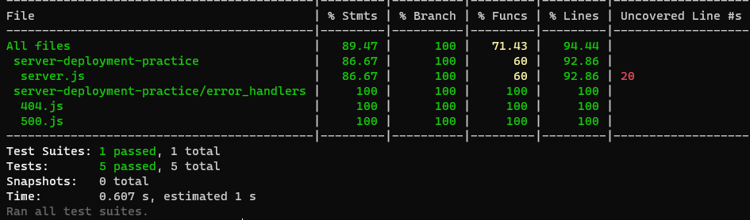
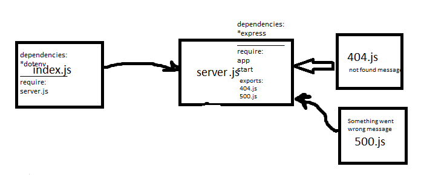

# server-deployment-practice

deploy a web server using CI and CD and get used to the general process of building and deploying servers.

[master deployed link ](https://rulaalqasem-server-deploy-prod.herokuapp.com/)

[dev branch deployed link](https://rulaalqasem-server-deploy-dev.herokuapp.com/)

[action link](https://github.com/RulaAlqasem/server-deployment-practice/actions)

[pull request link](https://github.com/RulaAlqasem/server-deployment-practice/pull/1)

[repo link](https://github.com/RulaAlqasem/server-deployment-practice)

How do I install the app or library?

- `npm init -y`

- ` npm i express dotenv`

- `npm i -D jest supertest eslint`

How do I test the app or library?

- `npm test`

result :

How do I run the app?

- ` nodemon`

/ : hello world

/data: server is visible (200)

/bad :Something went wrong (404 error)

/foo : "error": "Not Found" (500)

